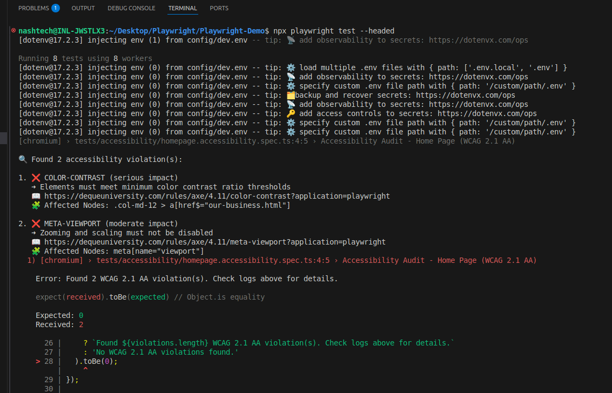
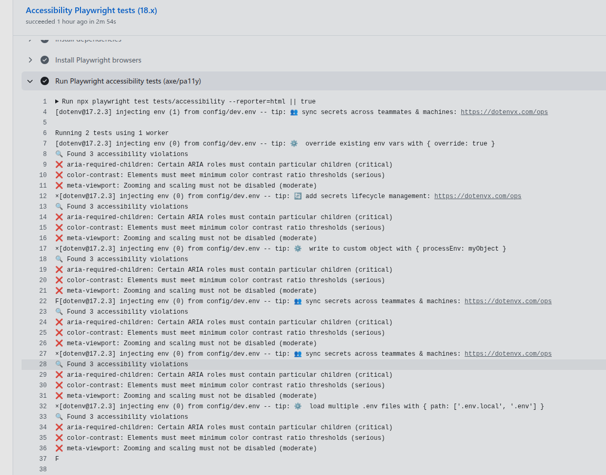

# Playwright Demo for Accessibility Testing (WCAG 2.1 AA)

This repository demonstrates functional and accessibility testing using Playwright and axe-core (and optional pa11y). It includes example tests, helper fixtures, and a CI workflow to run tests and upload reports.

## Project Structure

```
    PLAYWRIGHT-DEMO/
    │
    ├── .github/
    │   └── workflows/
    │       └── playwright.yml           # CI/CD workflow configuration for Playwright tests
    │
    ├── .vscode/                         # VS Code workspace settings
    │
    ├── config/
    │   └── dev.env                      # Environment variables for development setup
    │
    ├── fixtures/                        # Test data and reusable setup files
    │
    ├── node_modules/                    # Installed dependencies
    │
    ├── pages/
    │   └── home.page.ts                 # Page Object Model (POM) file for Home Page
    │
    ├── reports/
    │   └── Screenshots/
    │       ├── CI-Logs.png              # CI execution log screenshot
    │       └── Violation-Logs.png       # Accessibility violation log screenshot
    │
    ├── test-results/                    # Auto-generated Playwright test results (videos, screenshots, logs)
    │
    ├── tests/
    │   ├── accessibility/
    │   │   ├── homepage.axe-core.accessibility.spec.ts    # Accessibility test using Axe-core (WCAG 2.1 AA)
    │   │   └── homepage.pa11y.accessibility.spec.ts # Accessibility test using Pa11y
    │   │
    │   └── functional/
    │       └── home.page.spec.ts        # Functional UI tests for Home Page
    │
    ├── axe-core.helper.ts               # Helper for integrating Axe-core with Playwright
    ├── pa11y.helper.ts                  # Helper for integrating Pa11y accessibility checks
    │
    ├── playwright-report/               # HTML reports generated after test execution
    │
    ├── playwright.config.js             # Playwright configuration file
    ├── package.json                     # Project dependencies and scripts
    ├── package-lock.json                # Dependency lock file
    ├── .gitignore                       # Ignored files and folders for Git
    └── README.md                        # Project documentation

```

---

## Setup (local)

Prerequisites:
- Node.js 18.x (recommended)
- npm

Install dependencies and Playwright browsers:

```bash
   npm ci
   npx playwright install --with-deps
```

If you need TypeScript checks locally:

```bash
   npm install --save-dev typescript
   npx tsc --noEmit
```

---

## Run functional tests

The functional tests are stored under `tests/functional`.

Run locally:

```bash
   npx playwright test tests/home.page.spec.ts

   # open the generated report
   npx playwright show-report
```

Alternatively, use the npm scripts defined in `package.json`:

```bash
# Run only functional tests
npm run test:functional

# Run accessibility tests
npm run test:accessibility

# Run all tests
npm test

# Show the Playwright HTML report
npm run show-report
```

Artifacts:
- `playwright-report/` — HTML output produced by the Playwright reporter
- `test-results/` — attachments, traces, screenshots

---

## Run accessibility tests (axe-core)

Accessibility tests are implemented using `@axe-core/playwright` (axe-core integration for Playwright). Example usage is in `fixtures/axe-core.helper.ts` and the test in `tests/accessibility`.

Run locally:

```bash
   npx playwright test tests/accessibility/homepage.accessibility.spec.ts
   npx playwright show-report
```

Report locations:
- `playwright-report/` — Playwright reporter HTML (accessibility and functional runs)
- `reports/html/` — additional HTML reports if your tests generate them

---

## How axe-core works in Playwright (short)

1. axe-core is a widely used accessibility engine implementing WCAG rules.
2. `@axe-core/playwright` provides a convenience `AxeBuilder` that runs axe inside the browser context used by Playwright.
3. Typical flow in a test:
	 - Navigate the Playwright `page` to the target URL or state.
	 - Inject axe-core into the page context via `AxeBuilder({ page })`.
	 - Optionally configure tags or rules (e.g., `.withTags(['wcag2a','wcag2aa'])`).
	 - Run `.analyze()` which returns violations (with selectors, impact, and rule ids).
	 - Assert on violations (fail the test if violations exist) or log them for triage.

Example (from `fixtures/axe-core.helper.ts`):

```ts
   import { AxeBuilder } from '@axe-core/playwright';
   import { Page } from '@playwright/test';

   export async function runAxeAnalysis(page: Page) {
      const accessibilityScanResults = await new AxeBuilder({ page })
         .withTags(['wcag2a', 'wcag2aa'])
         .analyze();
      return accessibilityScanResults;
   }
```

Interpreting results:
- `violations` or `issues` contain the rule id, impact, description, and CSS selectors for failing nodes.
- Use the `impact` (critical/high/medium/low) and tags to decide what to block or triage.

Best practices:
- Run axe on stable, final DOM states (after dynamic content or animations finish).
- Narrow analysis scope if needed (e.g., `.include('main')`) to avoid noise.
- Configure `.withRules()` or `.withTags()` to target specific requirements.

---

## Screenshots

#### 1. Violation Logs


#### 2. Pipeline Logs
